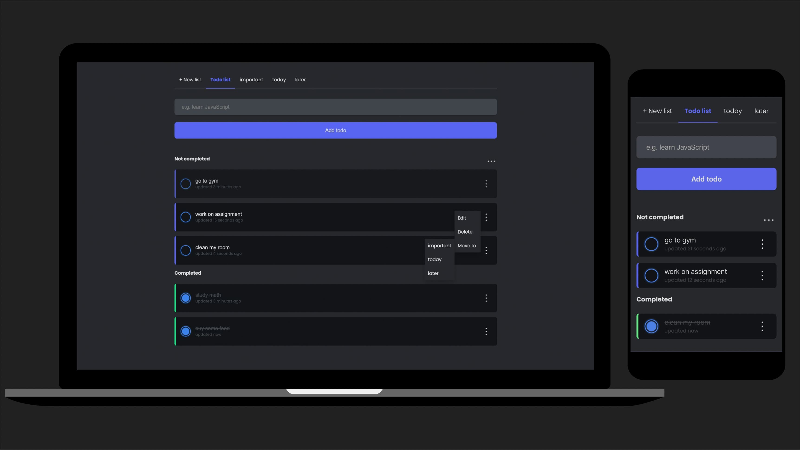

<h1 align="center">Todo List</h1>

## Demo

There is a demo to play around with: [demo](https://gilded-banoffee-c761a2.netlify.app/)

## Features

- Basic todo item CRUD
- Organize items per category
- Basic category item CRUD
- Responsive design for mobile support
- Bulk delete (delete completed todo items all at once)
- Display updated and created date time (can toggle by clicking the updated date time of todo item)
